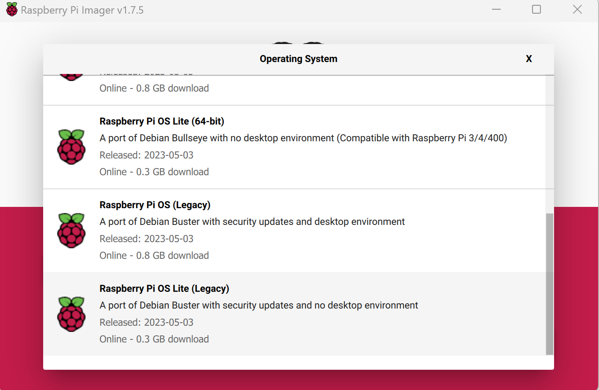
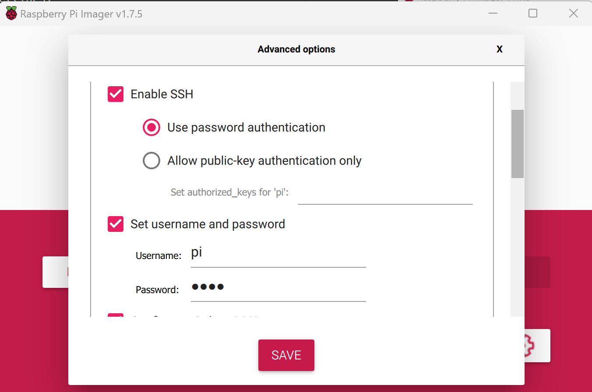
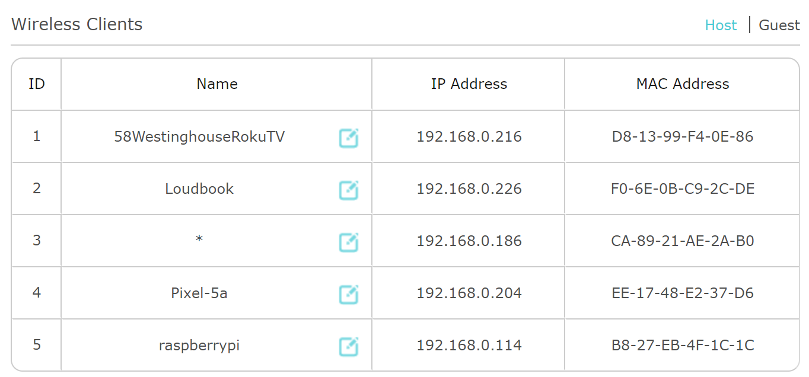
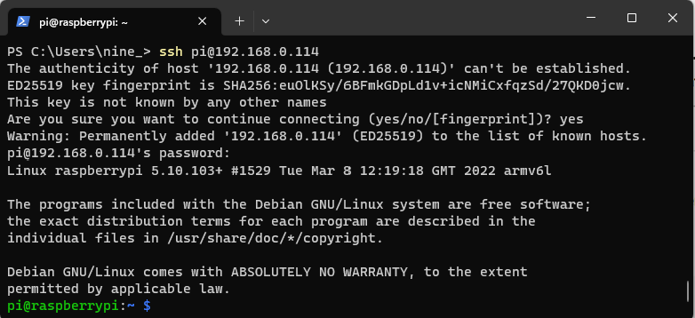
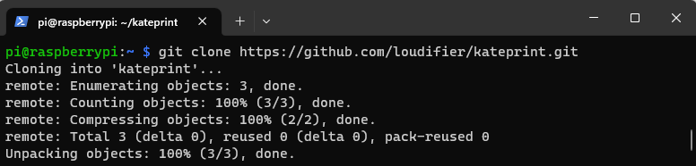
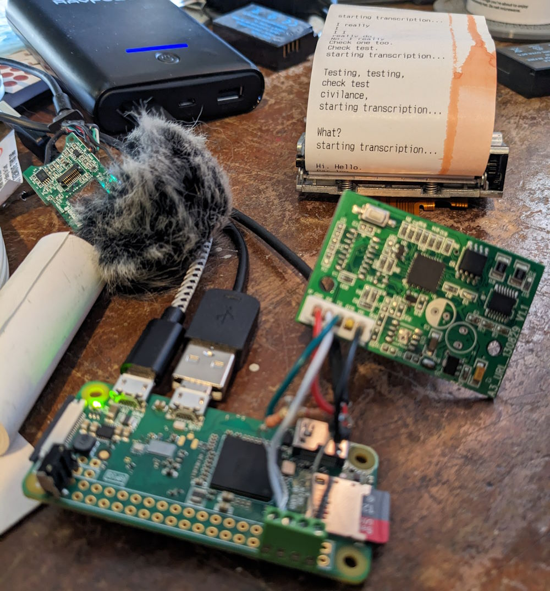
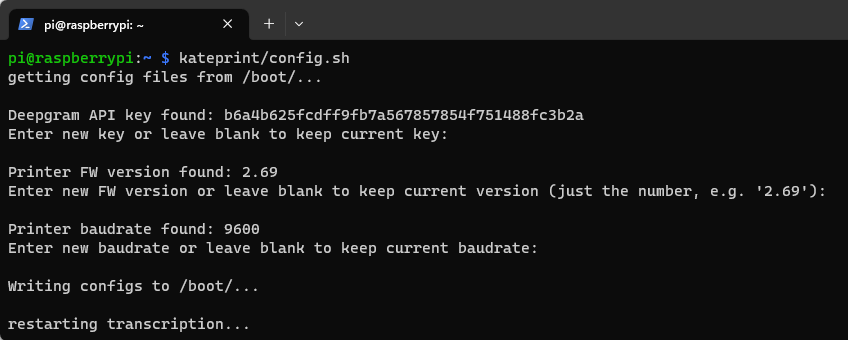

# kateprint
instructions and scripts for Kate's speech recognition balloon printer thing

## Raspberry Pi setup

1. Download and install the [Raspberry Pi Imager](https://www.raspberrypi.com/software/)  

2. Under Operating System, select "Raspberry Pi OS (other)", then scoll to the bottom and select "Raspberry Pi OS Lite (Legacy)". The initial setup was tested with Debian Buster, but newer versions of the OS or Raspberry Pi models will probably work fine. Linux is pretty fragmented, and newer or older versions of OS/HW might have broken software or dependencies as time goes on. YMMV   

3. Click the gear icon to change the initial settings. Enable SSH with password authentication, and set the username and password, u: pi p: kate. (note, the password can be whatever you want, but some scripts are hardcoded with the username 'pi') Also enter your wifi name and password, then click Save   

4. Select the SD card you want to write the OS to and click Write  

5. When the imager is done, put the SD card the your Raspberry Pi, **make sure the printer is powered off and the webcam and printer are disconnected from the Pi**, then power on the Pi  

6. Go to your wifi router's interface to determine its IP address. This might take a while on first boot.   

7. Open a terminal (Command Prompt/PowerShell/git bash/etc) and ssh in to the Pi using the username and password that you set up in the Imager, and the IP address from your router  
`ssh pi@192.168.X.X`  
  
If ssh complains about changed identification run the command `del ~\.ssh\known_hosts` to clear previous fingerprints (unless you use ssh a lot for other stuff this won't hurt anything).  

8. From the ssh terminal run  
`sudo apt-get update`  
`sudo apt-get upgrade`  
`sudo apt-get install git`  
Then download the files from this repository with  
`git clone https://github.com/loudifier/kateprint.git`  
  

9. Finally, run the setup script to download the remaining dependencies and configure the Pi to run speech recognition and printing on boot  
`./kateprint/setup.sh`  
This command will take a long time. When prompted, enter your Deepgram API key. The Pi will shut down when the setup is complete.  

10. Plug in the webcam, connect and power on the printer, then start the Pi. If everything is set up correctly, the printer should print out a transcription of whatever gets picked up by the mic.  


## Changing configurations
### Printer Configuration
To update the API key or the printer FW version or buadrate, shh into the Pi and run  
`./kateprint/config.sh`  
The script will prompt you to change the API key, baudrate, and FW version, then ask if you want to restart the transcription.  
  
You can also manually change the configurations. Shut down the Pi and insert the SD card into your PC/card reader, then edit deepgram-key.txt, baudrate.txt, and/or fwversion.txt in the root directory of the SD card. The new settings will be used the next time you boot the Pi.

### Switch wifi network

To switch to a different wifi network, shut down the Pi and insert the SD card into your PC/card reader. Create a text file in the root directory of the SD card called wpa_supplicant.conf. Add this text (with your wifi info) to the file and save it:
```
country=US
ctrl_interface=DIR=/var/run/wpa_supplicant GROUP=netdev
update_config=1

network={
ssid="YOUR_WIFI_NAME"
psk="YOUR_WIFI_PASSWORD"
key_mgmt=WPA-PSK
}
```
The pi should connect to the new wifi network the next time it boots. (It will also delete wpa_supplicant.conf on boot, so you will need to create a new copy every time you switch networks)